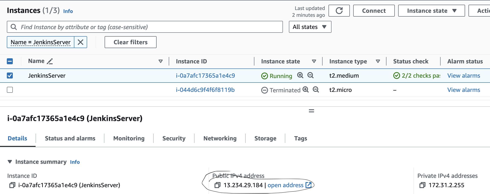
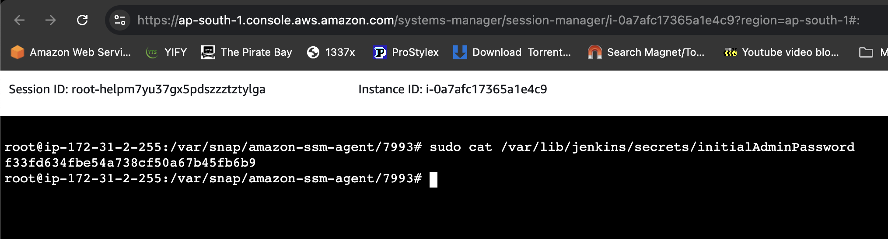
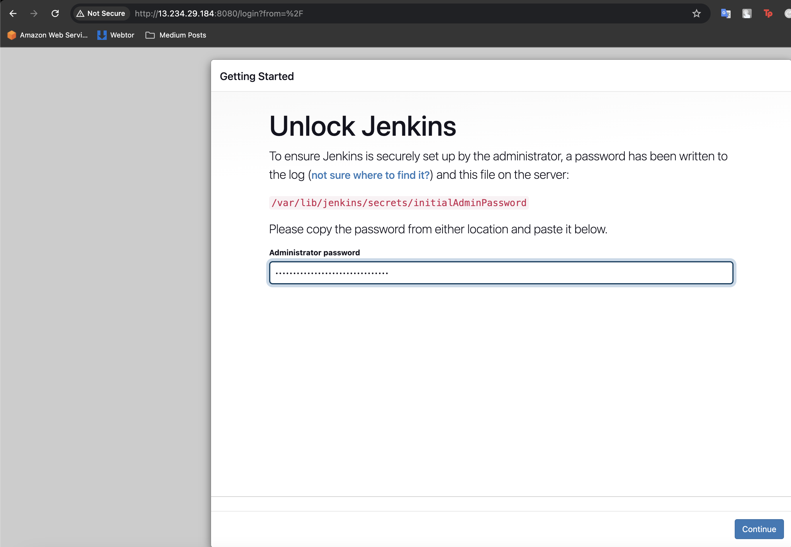
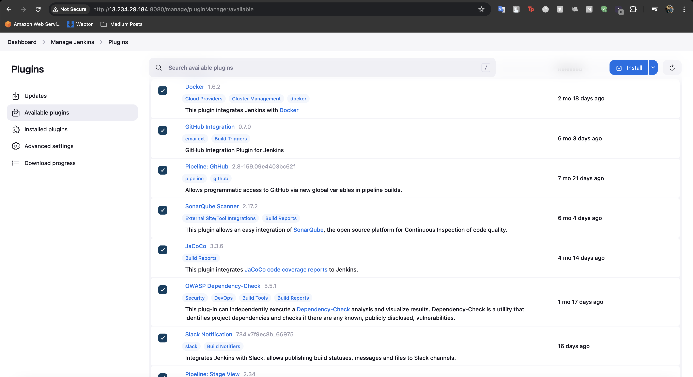

I have written a terraform code in terraform folder for launching an ubuntu instance and installing jenkins, java and docker in it. Used below commands to launch the jenkins server.

**alias tf=terraform**

**tf init**

**tf plan**

**tf apply**

Above commands will create an ec2 instance in your aws console, now head to the ec2 console on aws and find the public ip of the server.

Head to IP:8080 and see the below page to get the Initial password from the file "`/var/lib/jenkins/secrets/initialAdminPassword`", login to the ec2-instance using using either ssm or ec2-connect and use the below command to find the initpassword.

sudo cat `/var/lib/jenkins/secrets/initialAdminPassword`

Copy the password and paste it in jenkins-UI and click continue. and follow basic installation prompts.

Once the setup is done, go to plugins and install the below plugins,

