I have written a terraform code in terraform folder for launching an ubuntu instance and installing jenkins, java and docker, docker-copose in it, we are going to use sonarqube and sonar-scanner utility in a container with the help of docker-compose.yaml file in this repo. Used below commands to launch the jenkins server.

**alias tf=terraform**

**tf init**

**tf plan**

**tf apply**

Above commands will create an ec2 instance in your aws console, now head to the ec2 console on aws and find the public ip of the server.

Head to IP:8080 and see the below page to get the Initial password from the file "`/var/lib/jenkins/secrets/initialAdminPassword`", login to the ec2-instance using using either ssm or ec2-connect and use the below command to find the initpassword.

sudo cat `/var/lib/jenkins/secrets/initialAdminPassword`

Copy the password and paste it in jenkins-UI and click continue. and follow basic installation prompts.

Once the setup is done, go to IP:9000 to access the sonarQube Server running inside the container, use the default user:pass that's admin:admina nd then setup the password and click update,

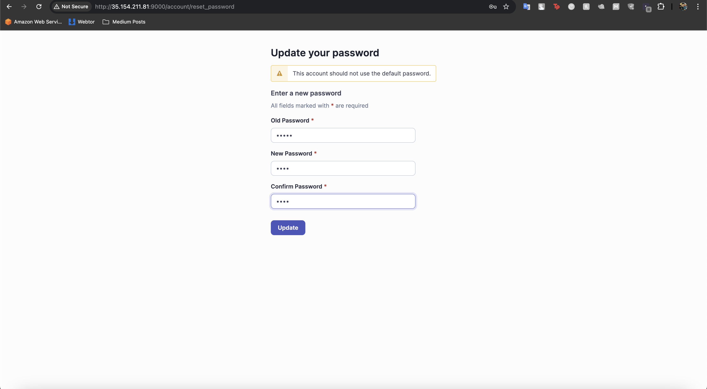

Once login go to Administrator > Security > Users, now either create a user or create a token for any existing user.

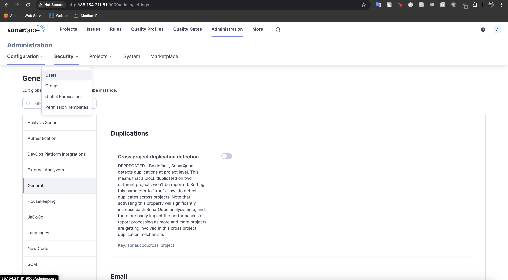

Copy the token for later use, "squ_0eee735baf39758e817877db5f926eccb726dc92"

Now go to projects and create a new project and populate the required fields and click next.

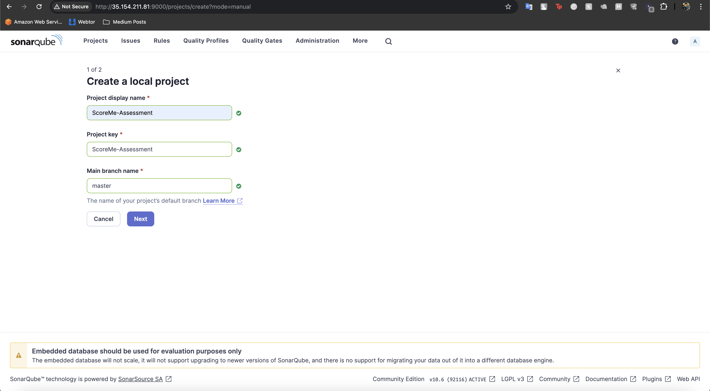

Click on use global settings and then  click on create project.

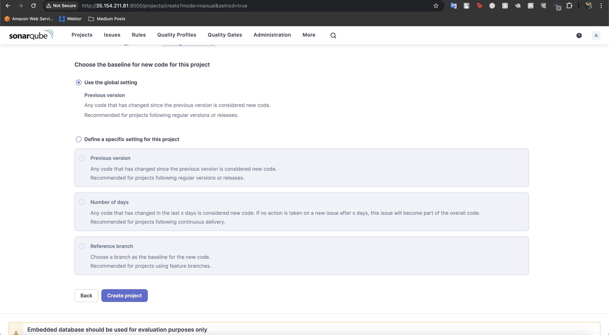

It will now ask you how would you want to analyze your code, use locally and select existing token, and use the token we created earlier, and follow the prompt, and then copy the code output.

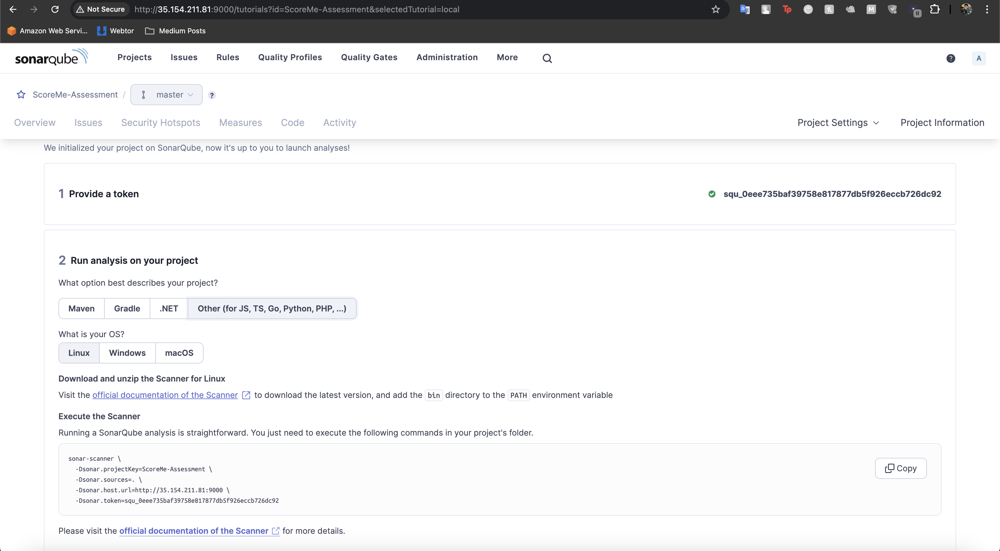

Now we have to create the Jenkins Credential to store the token.

Go to Dashboard > Manage Jenkins > Credentials > System > Global credentials (unrestricted) and click on Add Credential, put the token in secret and give any ID. and click create.

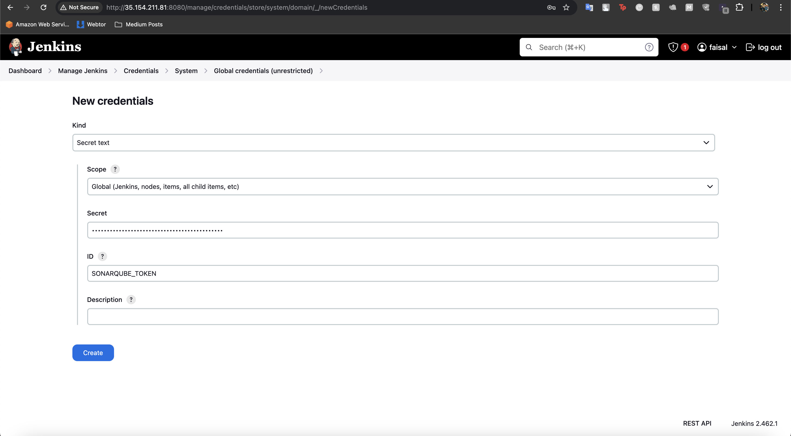

Now go to the "New item", select pipeline and give it a name and thenc lick ok,

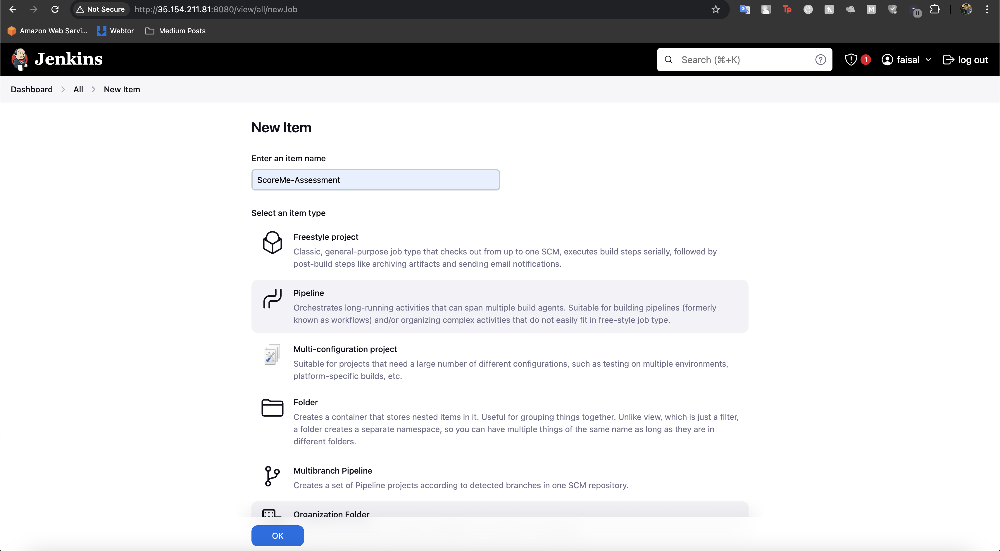

Select Pipeline script from SCM select git as scm and provide the github URL sleect branches and other things and the clicke save, then build it.

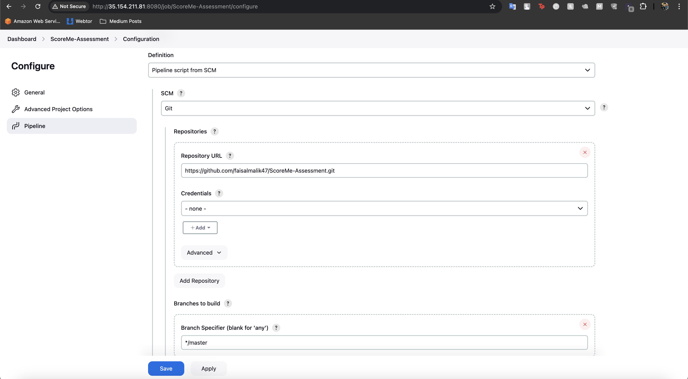

We're now done with the sonarqube and basic setups and integrations, let's add more to it now.

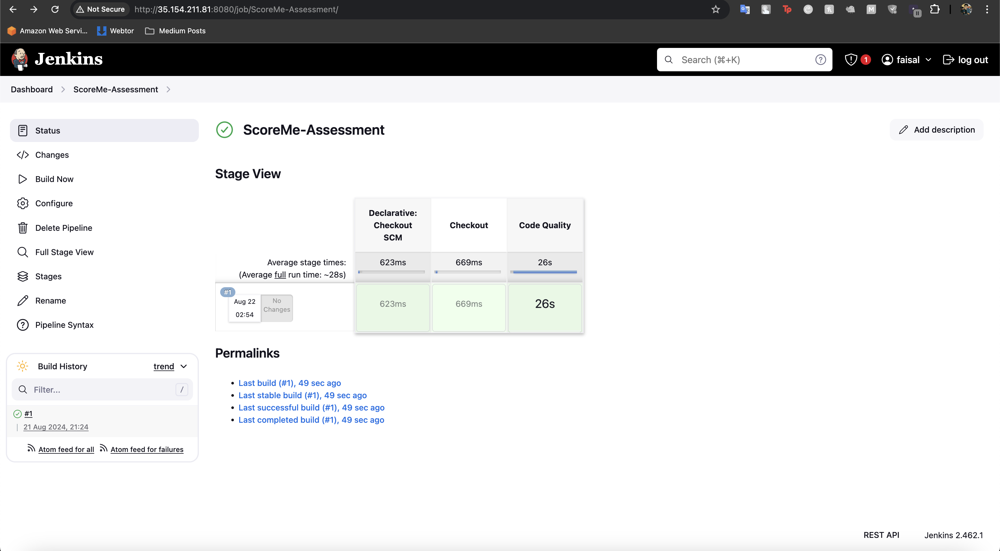

Now head to "https://WORKSPACE.slack.com/apps/new/", > Select a channel where you want notifications to be delivered > Add Jenkins CI > Scroll down and click Save settings and follow the recommened steps.

Copy the token and create a secret text in Jenkins credentials and then test the connection.

Creating the Credentials, go to Dashboard > Manage Jenkins > Credentials > System > Global Credentials > Add new credentials, fill the details and then save it like below.

Setting up slack integration, go to Manage jenkins > system > scroll down to fine Slack section , give exact name of your workspace and select the correct token from credentials and test the connection.

we can see that the test connection result was sucess, now save it.

Moving to the next step, we will configure sonarqqube now, head to IP:9000 port where sonarqube is already runnning, which we are using in a docker container that we started while launching the container, default user and pass is admin:admin, login using it and reset the password.

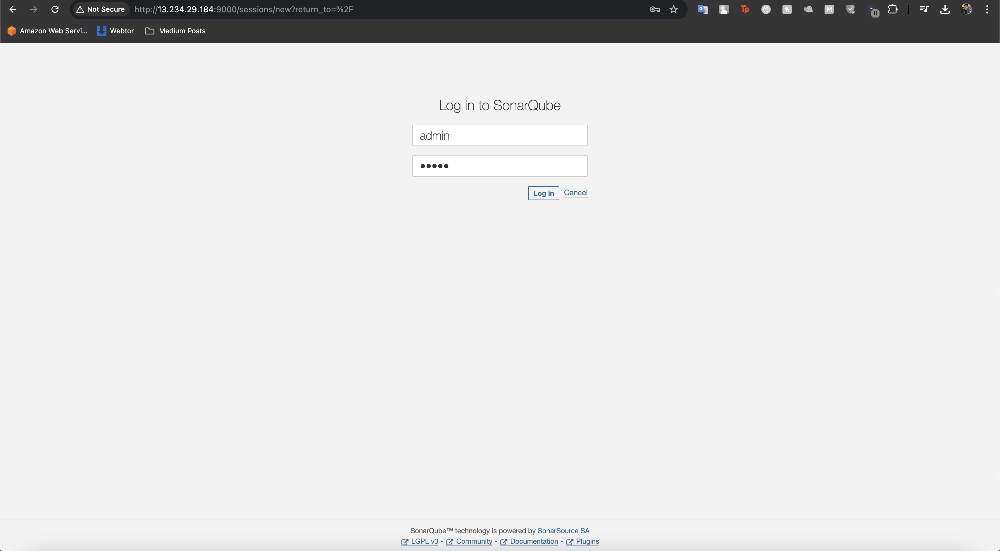

Now we will be going to the Administration > security and will create a new token and copy it.

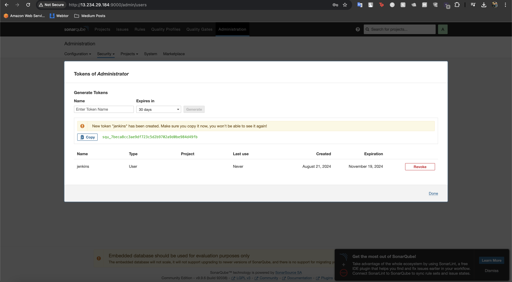

We will now create a crenetial of this token as a secret text with the name of sonar-token, like we created earlier. click on create.

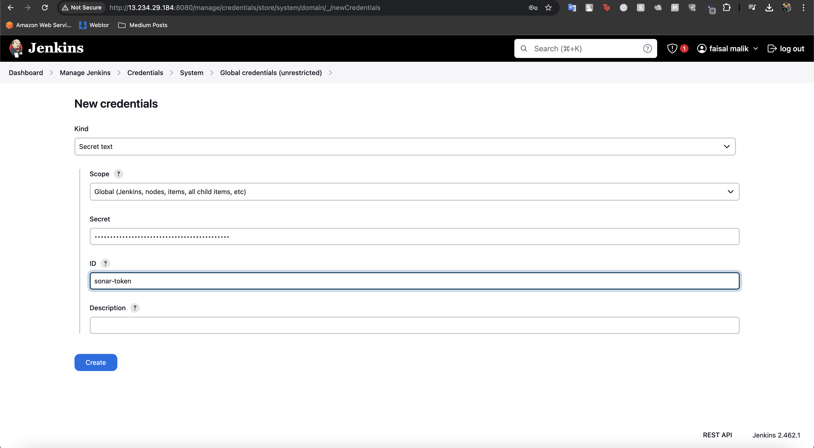

Now go to manage jenkins > system and scroll down to sonarqube server section and configure it. click on save

