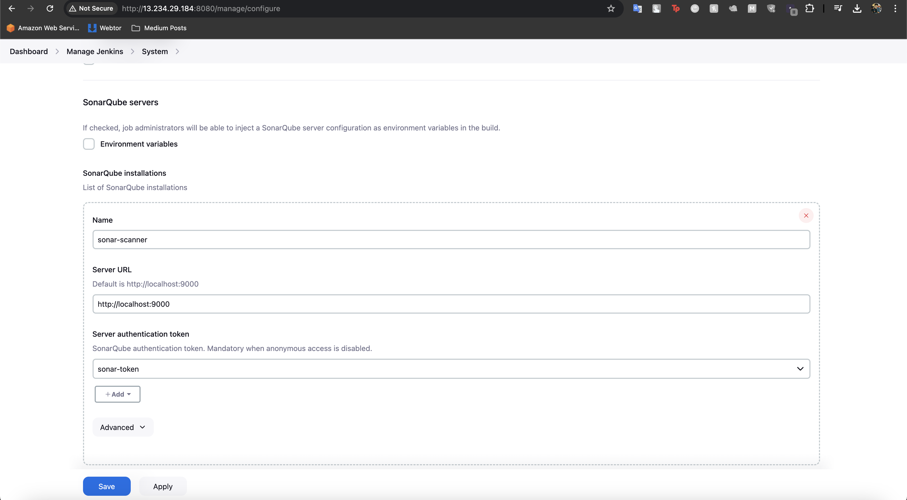

I have written a terraform code in terraform folder for launching an ubuntu instance and installing jenkins, java and docker in it. Used below commands to launch the jenkins server.

**alias tf=terraform**

**tf init**

**tf plan**

**tf apply**

Above commands will create an ec2 instance in your aws console, now head to the ec2 console on aws and find the public ip of the server.

Head to IP:8080 and see the below page to get the Initial password from the file "`/var/lib/jenkins/secrets/initialAdminPassword`", login to the ec2-instance using using either ssm or ec2-connect and use the below command to find the initpassword.

sudo cat `/var/lib/jenkins/secrets/initialAdminPassword`

Copy the password and paste it in jenkins-UI and click continue. and follow basic installation prompts.

Once the setup is done, go to plugins and install the below plugins,

Once we are done with these plugin installations, we need to go to manage jenkins > Tools to configure these installed tools, go to the path and scroll down to find out the name of these plugins like "SonarQube Scanner", "Dependency-Check installations"", "Docker installations" and others like that.

Open the Tools page is opened click on ass SonarQube Scanner and name it and allow jenkins to install in automatically click on apply and then save. We will Configure other tools like this only.

Do the same for docker but we will not install it automatically as we have already installed it in out jenkins server while provisioninig via install.sh script, click apply and save.

Do the same for Dependency-checker.

Now head to "https://WORKSPACE.slack.com/apps/new/", > Select a channel where you want notifications to be delivered > Add Jenkins CI > Scroll down and click Save settings and follow the recommened steps.

Copy the token and create a secret text in Jenkins credentials and then test the connection.

Creating the Credentials, go to Dashboard > Manage Jenkins > Credentials > System > Global Credentials > Add new credentials, fill the details and then save it like below.

Setting up slack integration, go to Manage jenkins > system > scroll down to fine Slack section , give exact name of your workspace and select the correct token from credentials and test the connection.

we can see that the test connection result was sucess, now save it.

Moving to the next step, we will configure sonarqqube now, head to IP:9000 port where sonarqube is already runnning, which we are using in a docker container that we started while launching the container, default user and pass is admin:admin, login using it and reset the password.

Now we will be going to the Administration > security and will create a new token and copy it.

We will now create a crenetial of this token as a secret text with the name of sonar-token, like we created earlier. click on create.

Now go to manage jenkins > system and scroll down to sonarqube server section and configure it. click on save

