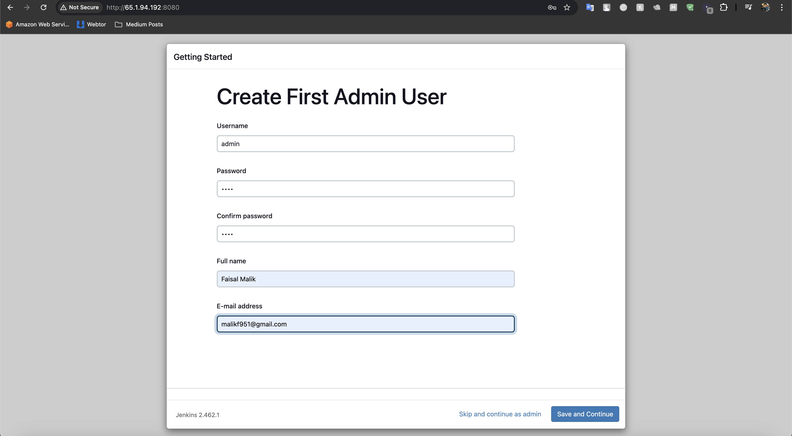
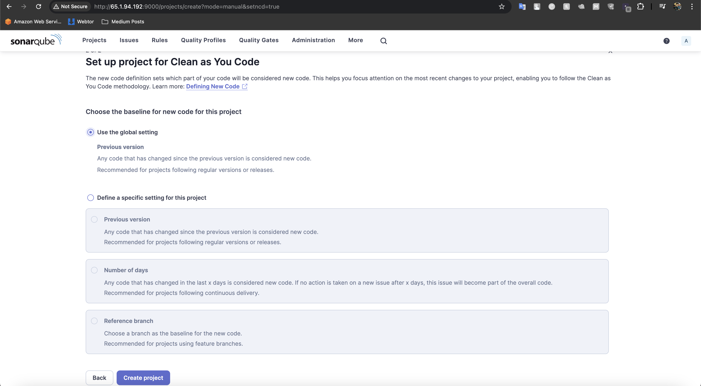
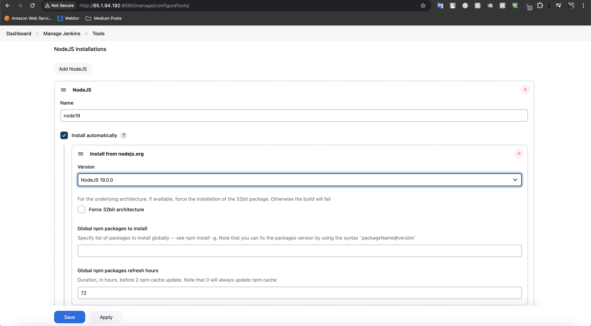
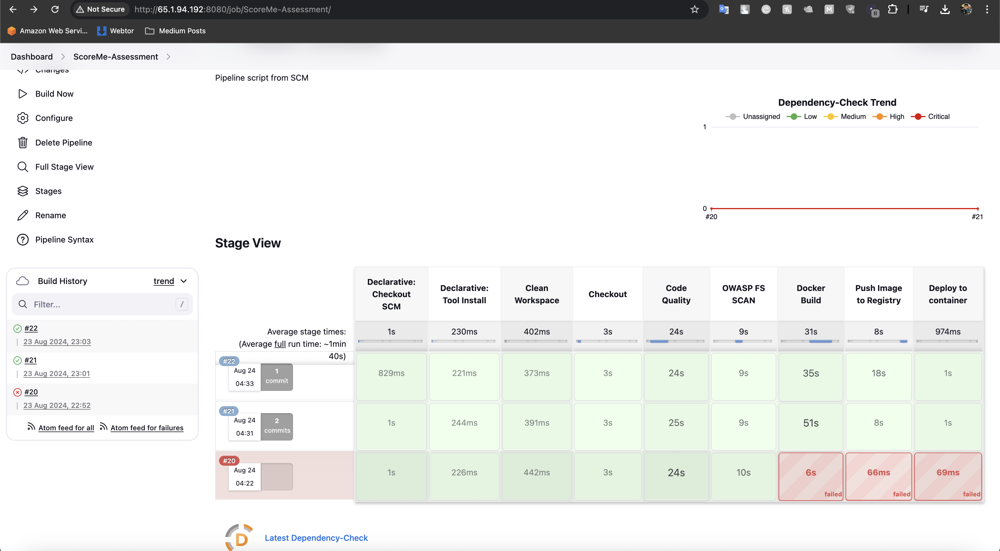
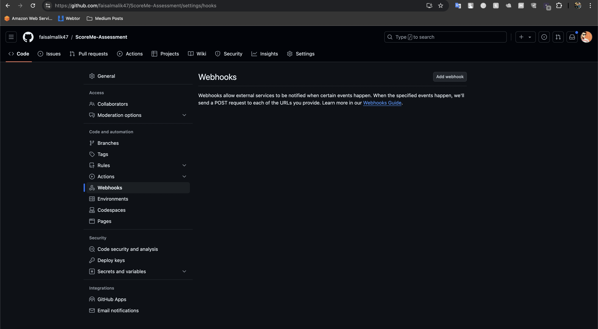

**Requirements:**

*DevOps Engineer Assignment:* 

Constructing a Jenkins CI/CD Pipeline

*Objective:*
The goal of this assignment is to create a Jenkins pipeline that integrates various open-source tools to assess code coverage, code quality, cyclomatic complexity, and security vulnerabilities. You will be demonstrating your ability to create an effective CI/CD process that aids in maintaining high-quality code standards in a software development project.
Requirements:

1. Jenkins Setup:
   ○ Install and configure Jenkins on a virtual machine or use a cloud-based service.
   ○ Ensure Jenkins is configured with the necessary plugins for Git and any other
   SCM tools you decide to use.
2. Source Code Management:
   ○ Use Git as the source code management tool.
   ○ Configure Jenkins to pull code from a Git repository (GitHub, GitLab, etc.).
3. Pipeline Creation:
   ○ Create a Jenkinsfile that defines the pipeline stages.
   ○ The pipeline should be triggered on every commit to the main branch of the
   repository.
4. Code Quality Checks:
   ○ Integrate SonarQube to analyze code quality and technical debt.
   ○ Configure the pipeline to break if the code quality gates are not met.
5. Code Coverage:
   ○ Integrate a tool like JaCoCo (for Java applications) or another relevant tool based
   on the programming language used.
   ○ Ensure that the code coverage report is published and accessible through
   Jenkins.
6. Cyclomatic Complexity:
   ○ Integrate a tool that can calculate and report the cyclomatic complexity of the
   code.
   ○ Tools such as Lizard (for C/C++, Java, Python, etc.) can be used.
7. Security Vulnerability Scan:
   ○ Integrate OWASP Dependency-Check or another similar tool to scan for known
   security vulnerabilities in the project dependencies.
   ○ Ensure that the vulnerability reports are accessible and that builds fail if critical
   vulnerabilities are found.
8. Notifications:
   ○ Configure Jenkins to send notifications (email, Slack, etc.) on build success or
   failure.
9. Documentation:

○ Document the pipeline steps, tools integrated, and any configurations needed for
the setup.
○ Include troubleshooting steps for common issues that might occur during the
build process.

Deliverables:

1. Jenkinsfile with complete pipeline configuration.
2. Documentation covering setup, configuration, and usage of the pipeline.
3. A report outlining the results of the initial run of the pipeline, including screenshots of the dashboard of each tool used. Evaluation Criteria:
   ● Completeness of the pipeline setup.
   ● Ability to integrate multiple tools effectively.
   ● Clarity and completeness of documentation.
   ● Handling of different scenarios (e.g., build failures due to quality checks).

**IMPLEMENTATION**

I have written a terraform code in terraform folder for launching an ubuntu instance and installing jenkins, java and docker, docker-copose in it, we are going to use sonarqube and sonar-scanner utility in a container with the help of docker-compose.yaml file in this repo. Used below commands to launch the jenkins server.

**alias tf=terraform**

**tf init**

**tf plan**

**tf apply**

Above commands will create an ec2 instance in your aws console, now head to the ec2 console on aws and find the public ip of the server. Connect to the server using SSH.

Access jenkins on port 8080 of ec2 public IP, and see the below page to get the Initial password from the file "`/var/lib/jenkins/secrets/initialAdminPassword`", login to the ec2-instance using using either ssm or ec2-connect and use the below command to find the initpassword.

**Configure Jenkins server.**

sudo cat `/var/lib/jenkins/secrets/initialAdminPassword`

Copy the password and paste it in jenkins-UI and click continue. and follow basic installation prompts.

Install suggested plugins.

Create user help us customize username and password of Jenkins.

Access SonarQube on port 9000 of Same Jenkins server. Server running inside the container.

Username: admin
Password: admin

Customize the password.

Navigate to Administrator → Security → Users.

Click on Tokens, Create one and save it. 

"squ_2e7192a210d22c5342986270d4a8b992321b8825"

Now Navigate to Projects → Create a local project → Fill in details and click next.

Use the global setting and click Create project

Once project is created click on Locally.

Select use existing token and click continue:

Select Others and copy the command, we will use it in our pipeline.

Now in Jenkins Navigate to Manage Jenkins → Plugins →Available Plugins and install the following.

* SonarQube Scanner
* Docker
* Docker commons
* Docker pipeline
* Eclipse Temurin Installer
* NodeJs Plugin
* Owasp Dependency-Check
* AWS Credentials
* Pipeline: AWS Steps
* Pipeline: Stage View

Restart Jenkins after they got installed.

Go to Manage Jenkins → Tools → Install JDK(17) and NodeJs(19)→ Click on Apply and Save.

Similarly install DP-check, Sonar-Scanner and Docker.

Go to Jenkins Dashboard → Manage Jenkins → Credentials. Add

Sonar-token as secret text.

Docker credentials.

Manage Jenkins → Tools → SonarQube Scanner. Then add sonar-server and created sonar-token.

**Create Jenkins Pipeline**

Up to this Let’s create a pipeline and see if anything gone wrong.
Click on “New Item” and give it a name selecting pipeline and then ok

Under Pipeline section Provide

Definition:Pipeline script from SCM
SCM :Git
Repo URL : Github Repo
Branch: master
Path:Jenkins file path in GitHub repo.

Click on “Build”.

Got an error., most probably syntax or indentation:

Got it fixed and pipeline failed again,

Issue:  Incorrect SonarQube Server URL, let me fix it and rerun the pipeline.

It was a simple URL mismatch error, now that our COde Quality stage is passed and successful, let's fix OWASP FS SCAN stage.

It says "NO installation DP-Checker found",

Worked now, the issue was with wrong name of DP-Checker, i configured it as DP-Checker, its fixed.

Seems to be an issue with Dockerfile, fixed it. 

Lets configure, notifcation and Failture Handling now.

Configuring Slack,

go to the URL "https://yourworkspace.slack.com/apps/A0F7VRFKN-jenkins-ci?tab=more_info" to integrate Jenkins CI tool.

Click on Add to Slack

Click on create new channel and give it a name and click next and then click create.

Select the created Channel from the drop down menu.

Click on Add Jenkins CI Integration, scroll down and copy the generated token.

Click on save settings.

Lets Integrate Slack to our Jenkins.

In Jenkins Navigate to Manage Jenkins → Plugins →Available Plugins and install the slack notifiction plugin.

Now go to Manage Jenkins → Credentials → System → Global Credentials → Add Credential

Put token from Slack ins ecret and name it, then click on create.

Now go to Manage Jenkins → System and look for slack section, give Workspace name and select the previously created credential, then click on test connection.

The test is successful.

Lets test our pipeline now, for the time being i have commented the stages of pipeline where it takes too much time to only test this stage, build completed successfuly and we recieved the message, lets modify it a little bit. 

Much better now.

As a final thing, lets Ensure we handle failure, in this pipeline in the case of a failure i will revert the container.

I've made a mistake in Dockerfile knowingly to test the failure handling.

As we can see below the current build number is 37, but in failure it reverted to the previous successfully build image which was done in build no. 36.

**ADDONS:**

Lets add a stage and we will be using trivy in a container for cleaner approach. Simple command is being used in this stage.

docker run aquasec/trivy image faisalmaliik/reddit:`<tag>`

Perfect!!

Scan report:

Now for the final part lets make this pipeline auto trigger on every new commit on Master branch.

Navigate to githubRepo --> Settings --> Webhooks --> Add Webhook

Populate the details like below:

click Add Webhook, and its successful.

Now in jenkins Navigate to pipeline --> configure --> in build trigger section select the "GitHub hook trigger for GITScm polling" option and we're done.

Lets test it now.

It works perfectly!!

